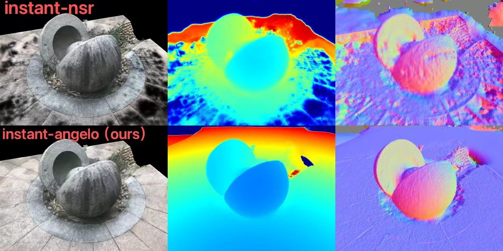
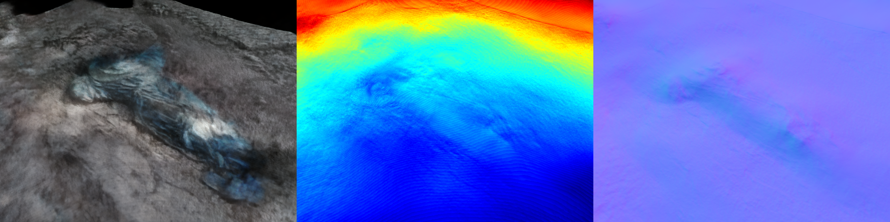

# Instant-angelo: Build high-fidelity Digital Twin within 20 Minutes!


## News (2023.12.22)
We are excited to announce that we have added a reimplementation of [UniSDF](https://fangjinhuawang.github.io/UniSDF/) to our project! UniSDF is a general purpose differentiable renderer proposed in the UniSDF paper that achieves state-of-the-art results on 3D reconstruction for reflection objects. 


https://github.com/hugoycj/Instant-angelo/assets/40767265/e374fcfe-de37-459e-97d9-8a0c49380d06


Please check out the [reflection](#reflection) mode to experience the improvements firsthand! In reflection mode, UniSDF demonstrates its ability to reconstruct reflective surfaces. We believe this addition will push Instant-angelo to new heights in rapid photorealistic neural 3D reconstructions. Further experiments and improvements on leveraging UniSDF will be conducted later.

## Introduction
Neuralangelo facilitates high-fidelity 3D surface reconstruction from RGB video captures. It enables the creation of digital replicas of both small-scale objects and large real-world scenes, derived from common mobile devices. These digital replicas, or 'twins', are represented with an exceptional level of three-dimensional geo-detail.

Nevertheless, substantial room for improvement exists. At present, the official and reimplemented Neuralangelo implementation requires 40 hours and 40 GB on an A100 for real world scene reconstructions. An expedited variant in instant-nsr has been developed, but the results have been subpar due to parameter limitations.

To fill this gap in high-speed, high-fidelity reconstruction, our objective is to engineer an advanced iteration of Neuralangelo. This refined model will focus on high-fidelity neural surface reconstruction, streamlining the process to achieve results within an unprecedented 20 minute timeline while maintaining the highest standard of quality. 

We provide [Quick Lookup](https://github.com/hugoycj/Instant-angelo_vis) examples of project outcomes. These examples can serve as a reference to help determine if this project is suitable for your use case scenario.

## Installation
```
pip install torch torchvision
pip install git+https://github.com/NVlabs/tiny-cuda-nn/#subdirectory=bindings/torch
pip install -r requirements.txt
```
For COLMAP, alternative installation options are also available on the [COLMAP website](https://colmap.github.io/)

## Data preparation
To extract COLMAP data from custom images, you must first have COLMAP installed (you can find installation instructions [here]). Afterwards, place your images in the images/ folder. The structure of your data should be as follows:
```
-data_001
    -images
    -mask (optional)
-data_002
    -images
    -mask (optional)
-data_003
    -images
    -mask (optional)
```
Each separate data folder houses its own images folder.

If you have the mask, we recommend filtering the colmap sparse point using it before starting the reconstruction. You can use the following manual script for preprocessing:
```
python scripts/run_colmap.py ${INPUT_DIR}
python scripts/filter_colmap.py --data ${INPUT_DIR} --output-dir ${INPUT_DIR}_filtered
```
In the script, ${INPUT_DIR} should be replaced with the actual directory path where your data is located.

The first line runs the colmap reconstruction script with full image. The second line filters the colmap sparse point using the specified mask, and saves the filtered data in a new output directory with the suffix "_filtered".

## Start Reconstruction!
### Run Smooth Surface Reconstruction in 20 Minutes

<details>
<summary>[Click to expand]</summary>
The smooth reconstruction mode is well-suited for the following cases:

* When reconstructing a smooth object that does not have a high level of detail. The smooth mode works best for objects that have relatively simple, flowing surfaces without a lot of intricate features.

* When you want a higher-fidelity substitute for instant-nsr that takes a similar amount of time (within 20 minute) to generate but with fewer holes in the resulting model. 

---

**Information you need to know before you start:**
* The smooth reconstruction mode's reliance on curvature loss can over-smooth geometry, failing to capture flat surface structures and subtle variations on flatter regions of the original object. 
* This mode relies on sparse points generated by colmap to guide the geometry in the early stage of training. However, SFM (Structure from Motion) can sometimes generate noisy point clouds due to factors such as repeated texture, inaccurate poses, or incorrect point matches. To address these issues, one possible solution is to utilize more powerful SFM tools like [hloc](https://github.com/cvg/Hierarchical-Localization) or [DetectorFreeSfM](https://github.com/zju3dv/DetectorFreeSfM). 
Additionally, post-processing techniques can be employed to further refine the point cloud. For example, using methods like Radius Outlier Removal in [Open3D](http://www.open3d.org/docs/latest/tutorial/Advanced/pointcloud_outlier_removal.html) or [pixsfm](https://github.com/cvg/pixel-perfect-sfm) can help eliminate outliers and improve the quality of the point cloud.
---

Now it is time to start by running:
```
bash run_neuralangelo-colmap_sparse.sh ${INPUT_DIR}
```
This script is designed to automate the process of running SFM without the need for any preparation beforehand. It will automatically initiate the reconstruction process and export the resulting mesh. The output files will be saved in the logs directory.

If mask is available and placed at the right place under data_folder you could start by running:
```
bash run_neuralangelo-colmap_sparse.sh ${INPUT_DIR}_filtered
```

</details>

### Run Detail Surface Reconstruction in 20 Minutes

Many thanks to [youmi-zym](https://github.com/youmi-zym) for creating the image on Tanks and Temples.
<details>
<summary>[Click to expand]</summary>

Generating high-fidelity surface reconstructions with only RGB inputs in 20,000 steps (around 20 minutes) is challenging, especially for sparse in-the-wild captures where occlusion and limited views make surface reconstruction an underconstrained problem. This can lead to optimization instability and difficulty converging. Introducing lidar, ToF depth, or predicted depth can help stabilize optimization and accelerate training. However, directly regularizing rendered depth is suboptimal due to bias introduced by density2sdf. Moreover, ensuring consistent depth across views is difficult, especially with lower-quality ToF sensors or predicted depth. We propose directly regularizing the SDF field using MVS point clouds and normals to alleviate the bias

Importantly, in real-world scenarios like oblique photography and virtual tours, dense point clouds are already intermediate outputs. This allows direct utilization of the existing point clouds for regularization without extra computation. In such use cases, the point cloud prior comes for free as part of the capture process. 
---

**Information you need to know before you start**:
* An aligned dense point cloud with normal is necessary, you could specify the relative path at `dataset.dense_pcd_path` in the config file
* The point cloud could be generated from various methods, either from traditional MVS like colmap or OpenMVS, or learning-based MVS method. You could even generate the point cloud using commercial photogrammetry software like metashape and DJI.

---

Now it is time to start by running:
```
bash run_neuralangelo-colmap_dense.sh  ${INPUT_DIR}
```
</details>

### \[Experimental\] Run Reflective Surface Reconstruction in 30 Minutes
https://github.com/hugoycj/Instant-angelo/assets/40767265/8ff8687c-35f6-4744-b09c-62665546c27c

<details>
<summary>[Click to expand]</summary>
    
**Information you need to know before you start**:

   * We implement several key techniques from [UniSDF](https://fangjinhuawang.github.io/UniSDF/) including: 1. Camera and Reflected Radiance Compositions; 2. Coarse-to-fine training strategy However, we currently do not implement contraction and proposal sampling. Instead, we use NeRF++ for background modeling and occupancy grids for sampling acceleration.
   * Due to GPU resource constraints, we do not implement the exact same parameters and training regimen as the UniSDF paper, which uses 8 V100s for 3 hours of training. In the future, we aim to continue experimenting with UniSDF to push reconstruction quality and efficiency. But for now, we have some adaptations allow UniSDF-enhanced performance on readily available GPU hardware with reasonable training times. Specifically, our modifications include:
      - Reduced MLP dimension from 256 to 64
      - Only 2 layers for the radiance MLPs 
      - 16 level NGP grid with 2 channels per level (vs 4 channels)
   * TODO List:
       - [ ] Contraction
       - [ ] Proposal Sampling
       - [ ] Preprocessed dataset links
       - [ ] Other regularizations in UniSDF
 
---

Now it is time to start by running:
```
bash run_neuralangelo-colmap_sparse_reflection.sh  ${INPUT_DIR}
```
</details>

## Frequently asked questions (FAQ)
<details>
<summary>[Click to expand]</summary>

1. **Q:** CUDA out of memory. 

   **A:** Instant-angelo requires at least 10GB GPU memory. If you run out of memory,  consider decreasing `model.num_samples_per_ray` from 1024 to 512

2. **Q:** What's the License for this repo?

   **A:** This repository is built on top of instant-nsr-pl and is licensed under the MIT License. The materials, code, and assets in this repository can be used for commercial purposes without explicit permission, in accordance with the terms of the MIT License. Users are free to use, modify, and distribute this content, even for commercial applications. However, appropriate attribution to the original instant-nsr-pl authors and this repository is requested. Please refer to the LICENSE file for full terms and conditions.

3. **Q:** The reconstruction of my custom dataset is bad.

   **A:** This repository is under active development and its robustness across diverse real-world data is still unproven. Users may encounter issues when applying the method to new datasets. Please open an issue for any problems or contact the author directly at chongjieye@link.cuhk.edu.cn. 

4. **Q:** Generate dense prior with Vis-MVSNet is slow
   
   **A:** Currently, preprocessing takes around 10~15 minutes for 300 frames, but there still remains much room to improve efficiency by replacing Vis-MVSNet with state-of-the-art methods like MVSFormer or SimpleRecon. Moreover, preprocessing time could be substantially reduced by leveraging quantization and TensorRT. Overall, MVSNet enables the creation of the necessary point cloud much faster than traditional MVS approaches, by an order of magnitude.


6. **Q:** This project fails to run on Windows

   **A:** This project has not been tested on Windows and the scripts may have compatibility issues. For the best experience at this stage of development, we recommend running experiments on a Linux system. We apologize that Windows support cannot be guaranteed currently. Please feel free to open an issue detailing any problems encountered when attempting to run on Windows. Community feedback will help improve cross-platform compatibility going forward.


</details>

## Related project:
- [instant-nsr-pl](https://github.com/bennyguo/instant-nsr-pl): Great Instant-NSR implementation in PyTorch-Lightning! 
- [neuralangelo](https://github.com/NVlabs/neuralangelo): Official implementation of *Neuralangelo: High-Fidelity Neural Surface Reconstruction*
- [sdfstudio](https://github.com/autonomousvision/sdfstudio): Unified Framework for SDF-based Neural Reconstruction, easy to development
- [torch-bakedsdf](https://github.com/hugoycj/torch-bakedsdf): Unofficial pytorch implementation of *BakedSDF:Meshing Neural SDFs for Real-Time View Synthesis*

## Acknowledgement
* Thanks to Fangjinhua Wang for his great work [UniSDF](https://fangjinhuawang.github.io/UniSDF/) on improving the reflective surface reconstruction
* Thanks to bennyguo for his excellent pipeline [instant-nsr-pl](https://github.com/bennyguo/instant-nsr-pl)
* Thanks to RaduAlexandru for his implementation of improved curvature loss in [permuto_sdf](https://github.com/RaduAlexandru/permuto_sdf)
* Thanks to Alex Yu for his implementation of spherical harmonics in [svox2](https://github.com/sxyu/svox2/tree/master)
* Thanks to Zesong Yang and Chris for providing valuable insights and feedback that assisted development
